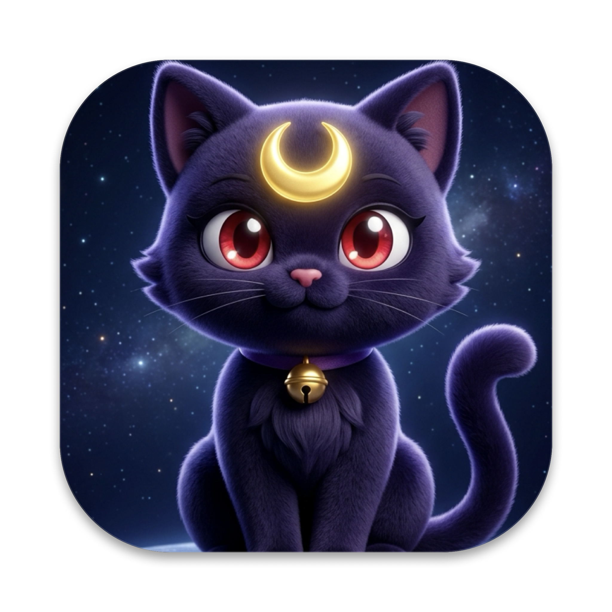

<div align="center">



# Luna Screen Recorder 🌙🐱
**A swift, lightweight macOS screen recorder built specifically for sharing UI bugs and behaviors with coding agents and teammates.**

[](https://apple.com)
[](https://swift.org)
[](https://github.com/nimitbhargava/luna-screen-recorder/releases/latest/download/Luna.zip)
[](LICENSE)

</div>

---

## ⚡ Quick Download (No Git Clone or Terminal Needed)

Don't want to build from source? Download the pre-built, ready-to-use macOS app directly:

👉 **[Download Luna.zip (macOS App)](https://github.com/nimitbhargava/luna-screen-recorder/releases/latest/download/Luna.zip)** *(~6 MB, Universal macOS)*

1. Download and unzip `Luna.zip`.
2. Move **`Luna - Screen Recorder.app`** into your `/Applications` folder.
3. Open it — Luna lives in your menu bar, ready to record!

---

## 💡 Why Luna?

When you're pair-programming with coding agents (like Antigravity, Claude, ChatGPT, or Gemini), default macOS recordings (`Cmd+Shift+5`) generate massive 100MB+ `.mov` files. Web chat interfaces choke on them, and Google Gemini frequently rejects them with *"Invalid Media / Unsupported file format"*.

Luna fixes this completely:
- **Instant Path Copy for Antigravity (<kbd>⌘</kbd><kbd>V</kbd>)**: Automatically copies the local file path on stop so AI coding agents can directly read the MP4 without media format errors or upload limits.
- Encodes straight to **H.264 MP4** with `+faststart` and silent AAC audio (~1–2 MB clips).
- **1-Click Copy as GIF**: Optional high-quality GIF generation for Gemini web, GitHub issues, or Slack.
- **Visual Window Picker** (just like Google Chrome / Google Meet) with live thumbnails.
- **Floating HUD** to pause, resume, and stop right on your screen without reaching for the menu bar.
- **Embedded Player** to preview and play your recording instantly after capture.
- **15-Day Auto-Delete**: Configurable during welcome onboarding — keep SSD tidy for throwaway debug clips, or keep files forever.
- **Context-Aware Menu**: Clean menu that only shows recording controls when you are actively recording.

---

## ✨ Features

- 🐱 **Sailor Moon's Luna**: Inspired by everyone's favorite moon-marked guardian cat keeping your workflow clean and light.
- 🎯 **3 Flexible Capture Modes**:
  - **Area Crop (<kbd>⌘</kbd><kbd>⌥</kbd><kbd>1</kbd>)**: Drag-to-select any region with live dimension tags and crosshair precision.
  - **Visual Window & Display Picker (<kbd>⌘</kbd><kbd>⌥</kbd><kbd>2</kbd>)**: Native visual sharing modal (just like Google Chrome / Meet) with live thumbnails of all open windows and displays.
  - **Full Screen (<kbd>⌘</kbd><kbd>⌥</kbd><kbd>3</kbd>)**: Instant one-click recording of your active display.
- ⚡ **Antigravity & AI Agent Optimized**:
  - Luna defaults to copying the **local file path** directly to your clipboard upon finishing a recording.
  - Simply hit <kbd>⌘</kbd><kbd>V</kbd> into Antigravity or your AI terminal for immediate multimodal video analysis.
- 🎬 **Floating Translucent HUD**:
  - A sleek floating glass pill on your screen during recording.
  - Controls: live timer, **<kbd>⏸</kbd> Pause & <kbd>▶️</kbd> Resume**, and **<kbd>⏹</kbd> Stop**.
  - Draggable anywhere, and **automatically excluded from recordings** (never appears in your video).
- 📺 **Embedded Video Player**:
  - As soon as you stop, Luna pops up with your video already playing.
  - Includes timeline scrubber, play/pause, timecodes, volume, and fullscreen support.
- ⏳ **Configurable 15-Day Auto-Delete**:
  - Recordings are saved to `~/Movies/ScreenRecordings/`.
  - On first launch, Luna asks if you want **15-Day Auto-Delete** enabled (recommended for throwaway clips) or **Keep Forever**. Toggle it anytime directly from the menu bar.

---

## ⌨️ Global Shortcuts

| Shortcut | Action |
|---|---|
| <kbd>⌘</kbd> <kbd>⌥</kbd> <kbd>1</kbd> | **Record Area**: Drag a region on your screen |
| <kbd>⌘</kbd> <kbd>⌥</kbd> <kbd>2</kbd> | **Choose Window / Screen**: Opens Chrome-style visual picker |
| <kbd>⌘</kbd> <kbd>⌥</kbd> <kbd>3</kbd> | **Record Full Screen**: One-click screen capture |
| <kbd>⌘</kbd> <kbd>⌥</kbd> <kbd>S</kbd> | **Stop Recording**: Finishes recording & opens the player |
| <kbd>⌘</kbd> <kbd>⌥</kbd> <kbd>R</kbd> | **Recent Recordings**: Opens the Luna player & recordings manager |

---

## 🛠️ Building from Source

If you prefer building it yourself:
```bash
git clone https://github.com/nimitbhargava/luna-screen-recorder.git
cd luna-screen-recorder
./scripts/build_app.sh
```
The compiled app will be placed at `Luna.app`.

---

## 🔒 Permissions
On first launch, grant **Screen Recording** access:
1. Open **System Settings → Privacy & Security → Screen & System Audio Recording**.
2. Toggle **ON** for **Luna**.

---

## 🤝 Contributing

We welcome feedback and feature ideas! **Please read [`CONTRIBUTING.md`](./CONTRIBUTING.md) before contributing.**

> [!NOTE]
> Given that coding agents write most underlying code now, **we prefer issues over pull requests**. Just open an issue with your idea in plain human language, and if we're aligned, we'll burn our own tokens to build and ship it!

---

## 💖 Credits & Acknowledgements

The name and mascot are an affectionate homage to **Luna**, the iconic crescent-moon-marked guardian cat from ***Sailor Moon***, created by **Naoko Takeuchi** and produced by **Toei Animation**. All rights and credits to the character belong to their respective creators.
